# Portfolio

This portfolio contains the week by week reflections of how I am going on my Visual Condition Project. It contains my personal Professional and Technical proficiencies, as well as thoughts on how well I did. It documents my learning experiences with Unity. 
To see my GitHub Repository, follow the link below. At thie GitHub Repository, you will find my app, extra logs and my wiki page which contains information regarding the process involved to make the app.
https://github.com/JamesGrigg/Visual-Condition-Simulator

## Week: 1
### Monday Class:
In this first class of week 1, we were tasked to set up our own workstations. This was most likely used to simulate the real world. We had to pick a spot in the project room, then setup our computers in our workspace. After that, we learnt about how the Projects work, which projects were available, and when we had to decide what project we wished to do. I was interested in doing the SysOps project as that is a career that I am interested in, but I also was very interested in game development. I knew game development was a popular topic so I wary of how long I was wanting to take to decide.

### Thursday Class:
Before the second class, I had an interview with Adon about which project I wanted to do. I had decided I was going to put Game development as my main project, and SysOps as my backup incase Game dev was full.
During our Thursday class, the project teams were announced. I had been put into the Game Development project, however I had been split off into a subgroup due to the number of people wishing to do Game Dev. I was split into a group of 3 with Mitchell Briggs and Nick Mulrooney. For this Thursday class, we just got to know each other. We learnt about who was confident at what things and quite quickly got friendly.

### Reflection:
This week I had to make a hard decision between working on a project which I think might be where I want to go in the future (SysOps), and a project which I had been interested in since I got to Otago Polytechnic. After a conversation with both of the lecturers in charge of both projects, I have decided to go with the Game development project, as it is something I am interested in, and I am not taking any paper like it this year, unlike with SysOps where I am taking a System Admin paper. This way I get a good feeling for both subjects.

## Week: 2
### Monday Class:
On the Monday class, we got introduced to the software we would be using. It was game engine known as Unity. This class was primarily focused on getting Unity up and running, then learning how to use it. Our computer were not powerful enough to run some of the basic tutorials so I resorted to going onto Youtube and the Unity documentation to learn how to start development with Unity.

### Thursday Class:
On Thursday, I began practising making scenes in Unity. The group had decided to dedicate the next few classes to primarily learning the fundamentals of Unity, so they began to follow a tutorial of how to make a roll a ball game. I jumped in head first and just started developing a small map with interactable objects. I wanted to learn about physics and colliders. I learnt the differences between the different colliders and which colliders are better for certain situations.

### Reflection:
This week was primarily about learning Unity. I spent the week just learning the basics of development in Unity, including basic things I should consider BEFORE I start developing to save me from stress in the future. I learnt a lot about the basic configurations for Unity to help with performance. From here, I will start playing around with Unity more focused on what my project will be, rather than just a generalised Unity trial.

## Week: 3
### Monday Class:
On the Monday class, I wanted to start focusing my attention towards the project, and what I was going to be making. At this point, I had not been assigned an actual project, I just knew that Adon was planning on doing something with Virtual Reality (VR) development on mobile devices. I began looking into how difficult it is to create VR apps and learnt that it was relatively straight forward. I began by reading up on Google DayDream as I had been given a Google DayDream VR Headset to work with. I read the documentation on how to setup a scene in Unity and watched a few tutorials. Once I had a fair idea of what I was doing, I began creating a scene in which the player just stands infront of a ball and they are able to pick it up and move it around. Honestly, the documentation for GoogleVR is rather lacking, and there isn't a lot of information online about it so I am going in with the basics and will learn from there.

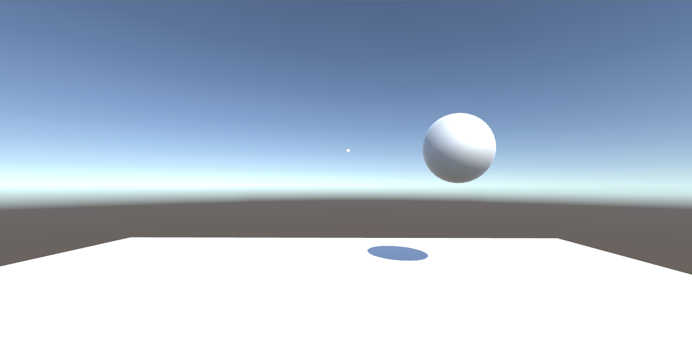
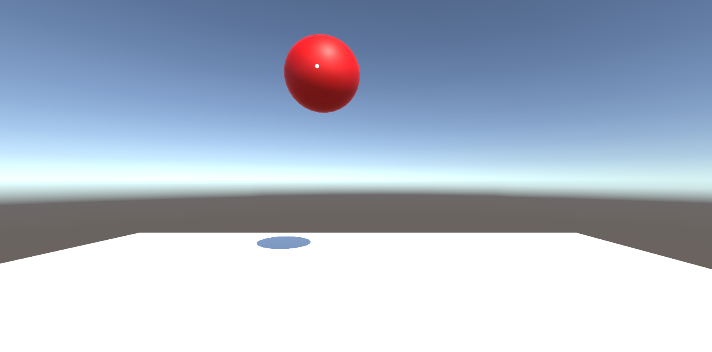

### Thursday Class:
On Thurday I got to class and continued work on my VR world. At this point I could pick the ball up and move it around, but once I released the ball, it remained exactly where it was. I decided to add gravity to it. (The code I used here ended up being used later on for the real project). During this class, I learnt that I would be working with visual impairments. Straight away I thought about Colour Blindness. I research some colour blindness plugins and presents and found a perfect one. I quickly implemented it into my Ball scene. I now had a game which you could pick up a ball while simulating different colour blindnesses.

### Reflection:
This week I finally started thinking about my project. I played around with Unity more specifically with my project in mind, and got a good feel for how I will be developing for the rest of the semester. With the lack of documentation online, I have been having to improvise the basic development for my GoogleVR setup, but after reading through the GitHub pages for GoogleVR, I think I have a good idea on what I need to be doing to get it all working.

## Week: 4
### Monday Class:
On the Monday class, I decided to dwell deeper into Colour Blindness. I began researching it, learning about which condition effected which colours and how it happened. This gave me a good understanding of the three main types of colour blindness, Protonopia, Deuteranopia and Tritanopia. From here I documented some key details on my Github page. I also played around with the colour blindness plugin I had aquired last class. 

### Thursday Class:
With the knowledge I now had from the Monday session, I created a basic showcase in Unity. I created a world with these blocks which were all different colours. The blocks were placed in a way which was able to show how different colours can easily blend together with colour blindness. This was a good starting ground for a visual impairments project. As a group, we also wrote down our README on Github, outlining what we could potentially do with this app. During the creation of this showcase, I wanted to know more about which colours were affected by other colours so I continued to document which colours blended with other colours. By the end of the class, I had a working showcase which did a good job in showing the different colours that blend with different types of colour blindness.

### Reflection:
Researching Colour Blindness taught me a lot about how visual conditions affect the human eye. Not just colour blindness, but also other visual condition. This will be helpful in the future once I start working with different visual conditions. By creating my colour blindness simulation world, I have gotten a good grasp on how to use Unity, and can now easily create simple worlds relatively quickly.

## Week: 5
### Monday Class:
This Monday class was very productive. Our group got split up into 3 solo groups. We were told we would be working with different clients based on the previous information we got told. I got assigned to work with Mary, who wanted to make a Visual Condition simualtion app. This was perfect, as I had already been learning about colour blindness. We met around 2pm, and discussed potential ideas. I showed her what I had been doing with the Colour Blindness and how it looks when in a VR headset. She loved the idea. Originally she had not planned on using colour blindness as one of the simulations but after showing this she said I should potentially implement it later on.
Some of the ideas we discussed were having a kitchen or office space in which the user has to interact with different objects with different levels of visual conditions applied. For example, trying to read an email when the user is suffering from Cataracts (a condition where the person's vision has becomne blurry). We both liked these ideas and I began brainstorming ways to proceed.
After this class, I emailed Mary and got a list of the visual condition she would like to see implemented into the app, as well as a list of visual conditions she might like implemented once the main ones were implemented.

### Thursday Class:
This Thursday class was essentially a research day. I had recieved the day before a list of the visual conditions that Mary wished to see in the game. I began to document on Github what these conditions were. Mary had also suggested getting an app on my iPhone which did a similar simulation but just through the camera. With the help of the app and some research, I was able to document how these different visual conditions affect the patient, while also creating a seperate Github wiki page that documented ways I thought of on how to implement these visual conditions as effects in Unity.
After I had done all this documentation and research, I started making a 3D kitchen in Unity. I imported some kitchen assets, and built a basic Kitchen with a bench and some objects ontop of the bench. All the user is able to do at this point is load up into this kitchen and look around.

### Reflection:
This week I finally started my real project. I now know what I am meant to be doing, and I have somewhere to start. I have been able to get some good research done about visual conditions, and have a few ideas on how I am going to implement them into a 3D world. After using the visual condition app that Mary suggested, I know exactly what I need to be aiming for.

## Week: 6
### Monday Home Session:
Over the weekend, I had worked on my Kitchen scene. I had used the code I had created for the Ball game a few weeks earlier, to implement physics into the objects that sat ontop of the kitchen bench. The user was now able to pick up pots and pans on the kitchen table and drop them causing them to fall back onto the bench, onto the floor or even into the kitchen sink. After making this, I encountered a bug. If I was to pick up objects and rub them against the kitchen bench, they would begin to fly out sideways for not reason with no control. I decided it wasn't a huge bug and I will worry about it later. Monday's class did not happen due to it being a Public holiday.

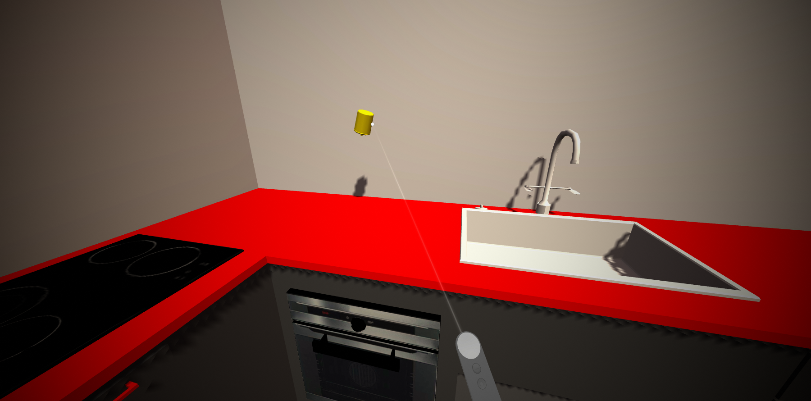
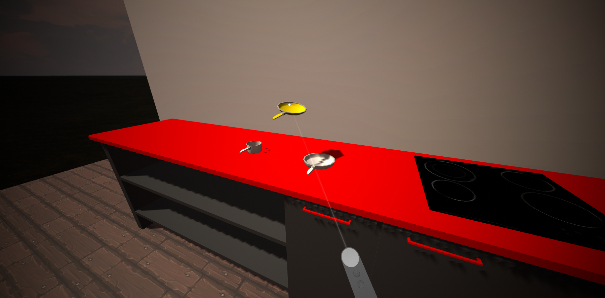

### Thursday Class:
This Thursday class I began looking into how to implement most of my visual effects. I decided that using Post Processing might be the best solution as both Mary and Adon had suggested being able to change the settings of the visual effect in game. I looked over the post processing effects and decided that the easiest one to start with would be Glaucoma as I could just create a Vignette that creates a faded tunnel vision effect. I was able to create the effect, but currently the only way to turn it on and off is outside of the game. I will implement a way later to be able to change it in game through a menu or something. I also realised a way to fix the magical flying pots bug. After watching a tutorial on an unrelated part of unity, I realised that when I turned gravity off, it meant that any force applied to an object would cause that object to fly away on a tangent. It was a simple fix. When the user interacts with an object, the objects gravity is no longer affected, and instead the object is turned to be in a  Kinematic state. This introduces the problem where there is no collision with objects that are being held, however this makes moving objects around a bit easier. I will worry about details like this later.

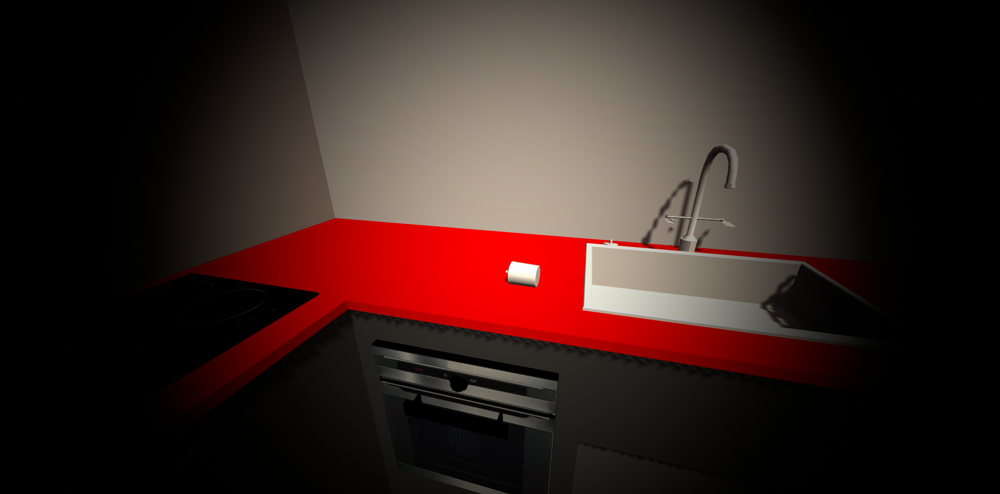

### Reflection:
This week I made some good progress on my Kitchen scene. I have got essentially the basics done. I have a good skeleton of what needs to be done. Hopefully the rest of my visual conditions will be as simple to implement as Glaucoma was, but I have a feeling ti won't be that easy since I am working with a mobile device.

## Week: 7
### Monday Class:
Today I looked into making a menu system for the simulation. I wanted to be able to access the different visual conditions while in the simulation. I looked into the best ways of making menus in virtual reality. One thing I stumbled upon was Google DayDream Elements. This was a package that contained all that was needed to create virtual elements inside of a virtual world specifically for the DayDream headset I was working with. Once I started using it, I quickly realised I would need to remake my project as Google DayDream wanted to reinstall the Google VR package I already had installed. It just ended up breaking my project, so I imported all my models into  anew project that I set Google DayDream Elements in, and went from there. Within about 20 minutes I had caught up to where I was and was ready to start development. I planned out how my menu would look on Paint.net. I made sure to annotate it a bit so that I could show Mary my ideas. Mary was unable to come in today as she was in a meeting, so we arranged a meetup on Tuesday instead.

###Below are some of the concepts for my menu systems.

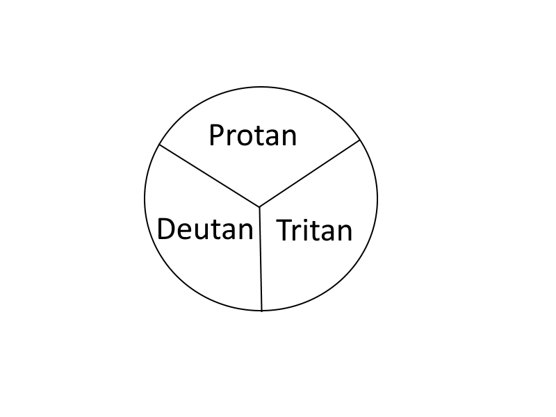
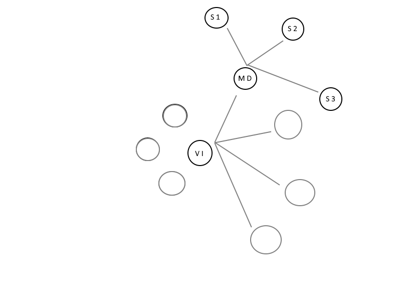

### Tuesday:
Today I met with Mary. This time we talked more specifically on how to make the simulation more enjoyable. We brainstormed ideas on what we could to do improve the usability and to make it more interesting. We talked about making the simulation into more of a game, rather than just a simple simulation. We brainstormed that we could have a game where the user has to do something specific, then redo something similar with visual conditions applied over top. We discussed about having visual condition stack ontop of each other. I then showed her what i had been working on. I showed her my Glaucoma effects and the kitchen with the objects with physics. She was happy with where I was in development. I clarified some extra details about certain visual impairments with her while she was in person, and now I know exactly where I need to go from here.

### Thursday Class:
After my meeting with Mary on Tuesday, Mary and Adon had a talk about new ideas regarding the simulation. They thought of ways to improve the feel of the game. They came up with an idea of making it more of a game. This time instead having pressured situations with a time limit or something close to that. Adon and I talked about it together and thought of simple ideas such as a pot in a kitchen is about to boil over but then the phone rings. It would be a rather simple fix without any visual conditions applied, but once the conditions are applied it would become much harder. This talk about making it more of a game definitely increased my interest on the topic and increased my performance. I also began work on my Menu system. I decided to follow a 'Constellation Menu' layout, where the menu progressively grows bigger as you choose mroe options. I felt like this way was the best for users in VR.

### Reflection:
This week I learned that I should have fully looked into what Google Daydream offered before I started working with GoogleVR, so that I wouldn't have had to remake my project. Luckily it was an easy fix as I am still early in development, but it could have been much worse. Otherwise I am glad I found their Elements package, it is very useful for what I want to be doing, and saves me a lot of development time.

## Week: 8
### Monday Class:
Over the weekend I had finished up a basic implementation of my menu system. It was able to print out the games of all of the options that I had in it which meant I simply had to attach things to do on the end. However, once I started trying to do this I was getting a null error which I didn't seem to understand.
On the Monday class, I asked Adon and some of the other game dev students for help. We realised that Unity had tried to instance the Post Processing Module multiple times, thus creating a null version of itself. In the end, it was an easy fix that just took a wee bit of time to find.
Mary was unable to make it for a meeting today, so we arranged to meetup during my Thursday class instead.
After this Monday class, I went home and implented a Glaucoma and a substitute preset for Cataracts in the menu. The menu can now add these effects over the user's screen, and they can stack. There is also a reset button that resets the effects.

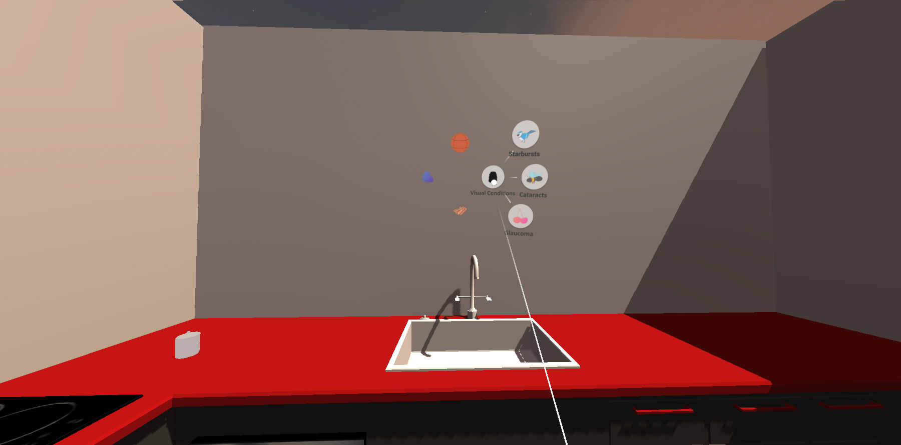

### Thursday Class:
Today I was scheduled to meet with Mary but she was unable to attend. So instead, I decided to work on cleaning up my project. I added colourblindness options to the menu as placeholders for future development (and as reminders to do my work). I also went through and removed all duplicate code and just generally cleaned up my code for my scripts. Other than that, I did not do much work as I was expecting Mary to arrive for a meeting and did not want to get too indepth with work and have to pause progress.

### Reflection:
This week I made good progress on my Constellation menu. It now works and I can now change the visual conditions in game. This is a must have feature for this, so I am glad I got it implemented early. It is a shame Mary couldn't make it in, as I wanted to make sure this is what she wants, but I am pretty sure she will be happy with how this works.

## Holidays:
Over the holidays, I did not have a lot of time to work on my project as I was not home for much of it. In the time I was able to work on it, I focused on cleaning up the game and making it more user friendly, as well as add a few more features to the game.
The first thing I did was add a menu system. At the moment, it simply just has a "play" button which when clicked, activates the objective in the game. I also prevented the user from interactng with objects in the world until the play button has been clicked to prevent them from messing up the scene before they are meant to.

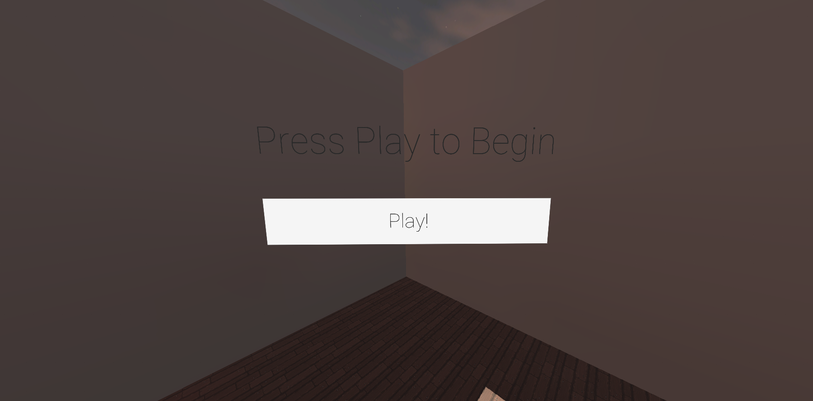

My next part was to add in some missing visual effects. I began by creatign a new blur shader to represent Cataracts as there was no good plugins for Unity which provided the blur I wanted, while also running smoothly on a mobile device. This caused the most problems as mobile devices do not like using shaders, so as it stands, my current blur shader reduces performance rather heavily. This doesn't matter too much when it is used alone, but once you start stacking other visual conditions with it, the game really begins to struggle. With all my visual effects stacked, it reduces performance to around 25-30 fps which is borderline unplayable in a VR situation. For now, I am going to leave it as it is and work on more important features.

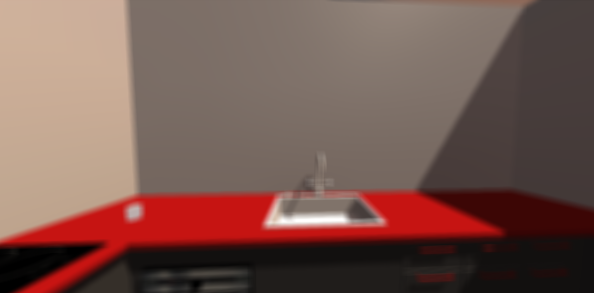

Next on the list was to implement colour blindness as I had already played around with it previously. It turns out that the shaders I was using were too performance heavy for mobile devices. I researched some new ways of implementing it and found a much more optimsed mobile shader which worked very similarily, except excluded tritanopia. I have implemented this for now, and will try and find a solution to implement tritanopia in the future.

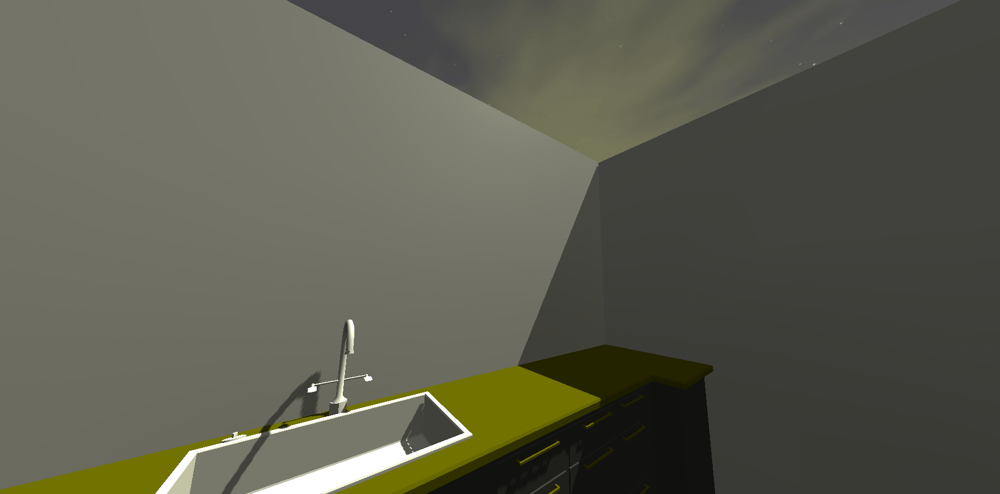

I wanted there to be more interaction with the environment to make the kitchen feel more realistic. To get this feel, I added in an interactable cupboard below one of the kitchen benches, as well as a drawer that slides out under the sink. This way the user is able to open and close the doors, and put stuff inside of these places. It worked well, however it felt a little clunky to use, so I decided to rework my pointer, and how it interacts with objects. I opted to change my pointer from being a simple GVRpointer, to being more of a manipulation pointer. This means that I added a smoother reticle, as well as the pointer's laser now dynamically moves based on the 'mass' of an object. If you pick up and object, the laser now bends depending on what the object it. It just makes everything feel a little more realistic, and also prevents the reticle from falling off of objects (especially the cupboard and drawer) when using them. While I was adding this feature, I also added in the ability to move and object forward and backwards in the world space simply using the touch pad.

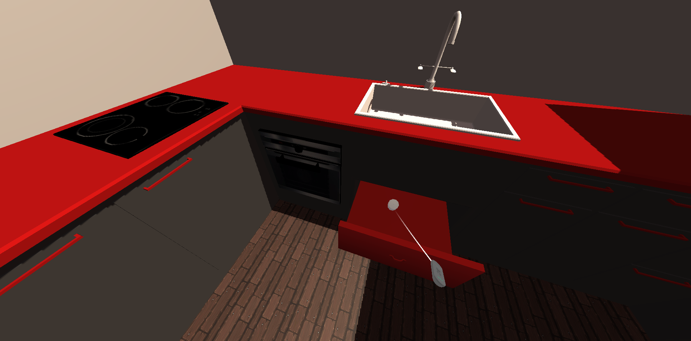
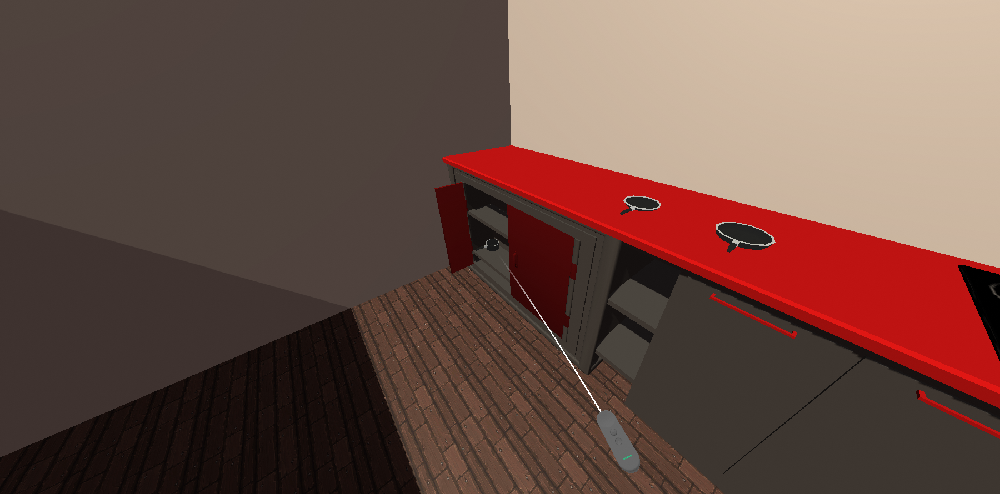

Lastly I just cleaned up the game a little. I changed the way that shadows are rendered in the game. They now look a lot smoother and not as ugly, while running better on mobile than they used to. I also added a simply hover effect that highlights objects when hovering over them.

### Reflection:
Over these holidays, I mainly aimed on making the game more 'user friendly'. I gave the game a menu system which will be built upon, and I have added a better pointer interaction. Overall, the game feels a lot more polished, even in it's ugly state. With the inclusion of the drawer and cupboard, I have opened up the possibilities for more game objectives to make the game harder and more fun. Overall, even tho there wasn't a heap of work done over the holidays, there was some important changes that needed to happen and I am happy where with the project is at so far.

## Week 9:
### Monday Class:
Today was the first day back after the break. I met with Mary and showed her what I had been working on over the holidays. She was pleased with what I presented. We discussed further ideas and talked more about what we wanted to have in the game side of the application. We talked about having a checklist system implemented, and other types of objectives we could add into the game. Other than that, nothing really happened today.

### Thursday Class:
Today, Adon talked to me about the game and decided he wanted me to try and implement a HUD (Heads up display) into the app to try and make it easier for people to keep track of visual conditions, and objectives. He also mentioned that on Monday, we will be having an open day, and he wanted me to prepare a basic game for the kids to be able to play when they come in. We agreed that we could just use the simple game that already exists (which is to put the object into the sink), but have it so once the user puts an object into the sink, a visual condition is applied (and so on). I knew exactly where to begin on this and started implementing it. At first, I started working on the HUD, however I quickly realised that the way Unity handles a HUD type system inside VR was going to make things difficult. I got a basic HUD setup and then proceeded to work on the game.

### Reflection:
This week I turned this prject into a game finally. It might not be a very good game, but it is a start. It will get tested on Monday at the Open day, and I will get some feedback on it and hopefully the feedback I get is positive. I am looking forward to getting some suggestions on what needs improved so I have things to work on.

## Week 10:
### Monday Class:
Today we had the first of the Otago Polytechnic Open Days. Over the weekend, I finished up the game for the open day, as well as the HUD. Unfortunately, I did not have enough time to finish the HUD, and so once a visual effect was applied to the user, it effected the HUD as well. This was fine as this was just a day to test out the app for new people. I spent the whole class (plus a few hours before hand) showing off my application. For the most part, everyone played the game easily with minimal instruction, which I found to be a success, since it was not too indepth for new players. I got some notes from some of the users, including users who had previous use of Unity, and they all agreed that the HUD needed to be ontop of the visual conditions, which I agreed with.

### Thursday Class:
I started working on making my HUD visable over the visual conditions. I had an idea of using multiple cameras to trick the game into displaying it over top, and started looking into it. My first concern was that multiple cameras may cause performance issues on mobile devices, however this did not seem to be the case. I proceeded to work on implementing a multi camera environment, and it worked to my amazement. The only issue was to have it in a location in 3D space that was not to odifficult to read in VR, nor was it too imposing on the user. This just took a big of trial and error to get right, but now I have a basic HUD setup and ready to deploy in the future.

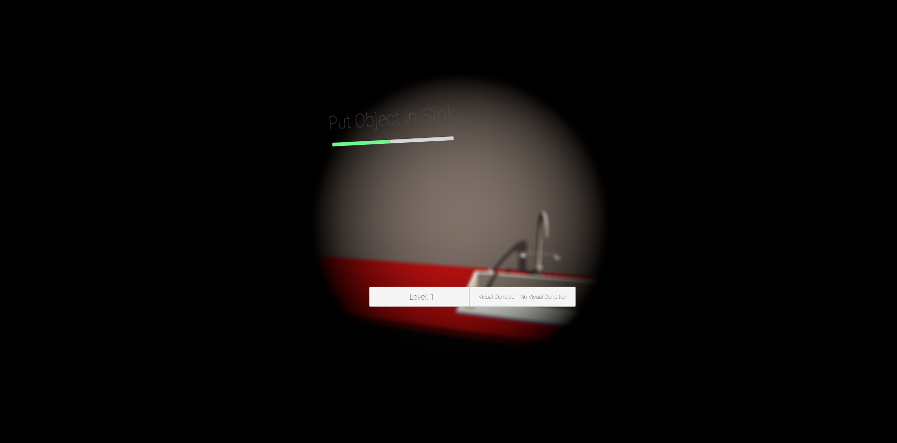

### Reflection:
This week I learnt that Unity can easily handle having multiple cameras in a single scene. This was very interesting to learn, and became very useful for implementing my HUD properly. With the positive feedback coming from the Open day, I am happy with where my game is, and now have some ideas on where to go from here.

## Week 11:
### Monday Class:
I was unable to go to this class as I am sick. So far this week I have not done any work as I have not felt well enough to work on this.

### Thursday Class:
Same situation as above. Was sick on this day as well, and was unable to go to class. This week consisted on minimal work which involdd just updating logs, and fixing up a couple of small bugs. 

### Reflection:
Yeah... I was sick so not a lot happened. Not much to reflect on, other than getting sick isn't fun. I was able to clean up some logs and work on this documentation tho which is helpful.

## Week 12:
### Monday Class:
Today I began working on some new features to implement into the game. I started playing around with newer objectives to add into the game, such as having the user put things into the drawers and cupboard instead of just the sink. Today was primarily just experimentation on how easily it was going to be to use triggers in unity, especially ones that move (for in the drawer). I got a good idea on how to implement these new levels and will progress from here.

### Thursday Class:
Today I found out that I would be doing the TEXpo this weekend in the Hub. I would have to present my app once again (just like the other Open day), and decided to stick with the app i used on that Open day. I cleaned up that version of the app, and included the HUD which isn't affected by the visual conditions. I didn't really work anymore on the project, rather than cleaned up the old version so that I can get some more accurate feedback from the TEXpo.

### Saturday:
Today we had the TEXpo in the Hub at Polytech. The TEXpo ran from 11am to 4pm, and I had to present my app. I had plenty of people come and use the app, and was able to get some valuable feedback in regards to certain features the users liked and disliked, as well as features they would like to see implemented. People seemed to have quite positive feedback regarding the app, however it was hard to judge properly as most people were too shy to really give the app a go as they had to wear the headset. The people who did give it a go, suggested that I need to emphasise the visual condition's name as they were too distracted playing the game to take time and read the HUD. Other feedback suggestions and ideas are on the "Brainstorm Ideas / Feedback" wiki page. It was good to be able to get some consumer feedback on the product, and it has given me some things to work on since I was starting to run out of good ideas.

### Reflection:
The TEXpo was a fun experience. I got some valuable feedback from all types of people, and all of it was positive. A lot of people were impressed with it, and others were happy to hear that it was to help with research of visual conditions. I got some good ideas from users on how to make the game better for users, especially users who have never used it before. The app must be at least a little enjoyable as we had a few kids get really into the game and play with it for a long time. From here I have some good ideas on what to do.

## Week 13:
### Monday Class:
First day back after the TEXpo, and I have learnt that I will be going up to my old high scoool, Otago Boys' High School, for their careers day on Thursday to present my app for the IT stand. I knew straight away that I won't have any time to try and implement new features by Thursday, so I decided just to clean up a few things that I got from feedback from the TEXpo, and then just continue looking into how to implement a few other features after the careers day was finished.

### Thursday Class:
Today I was at Otago Boys' High School for their careers day. I presented my app at the IT stand. This event went from 9am to 12pm, however I had to leave slightly early at 11:30. This day served as a more consistent testing period than the TEXpo, as the people who came and tried out the app were mainly students who were studying digital technologies, and were genuinly looking at a career in IT. They were interested and gave the game a good go. With many of them having some basic programming knowledge, they were able to have a good conversation with me about new concepts for the game, as well as other ideas on how to go about doing things. Overall it was rather helpful for ideas on how to progress the game. Refer to the "Brainstorm Ideas / Feedback" wiki page for moe information of things I learnt there.

### Reflection:
This week served as another good week for testing and feedback. With the collection of feedback I have recieved, I believe I know where I need to go. I need to start by making the visual conditions more prominent, and the HUD might need a change of sorts.

## Week 14:
### Monday Class:
This class was an experimental class. I looked into how lighting worked in Unity. I learned about how to bake lighting and how to make it better for performance on a mobile device. Next class, I will try and implement it into the scene. Other than that, I didn't do anything else as learning about this took quite a while.

### Thursday Class:
Today I worked on making the scene look a little nicer. I have added in a light on the wall, a roof to the kitchen and have baked the lighting so that it looks mor realistic. I have also added a window into the kitchen, which has a small lawn outside with some grass and trees. It's nothing too beautiful, but it gives the scene some life. The hardest part is making a nice environment that will still run at 60fps on a mobile device, as anything less than 60fps can start causing issues in VR. This is difficult to balance out since my shaders already cause some performance drops. 

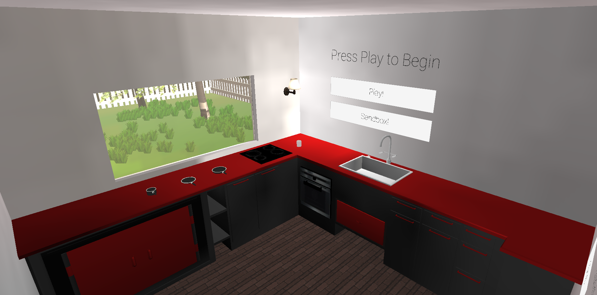

### Weekend:
I have got into contact with Mary, and we have arranged a meeting on Monday to see how the product is looking. I have also added a small tutorial section to the game, which is just on the wall to the right of the player. It gives the basics on how the game works as well as how the controls work. I have also finally implemented the sandbox mode, which was a highly requested feature. The game is sectioned and has 3 levels per section. At this point, the game is pretty much finished.

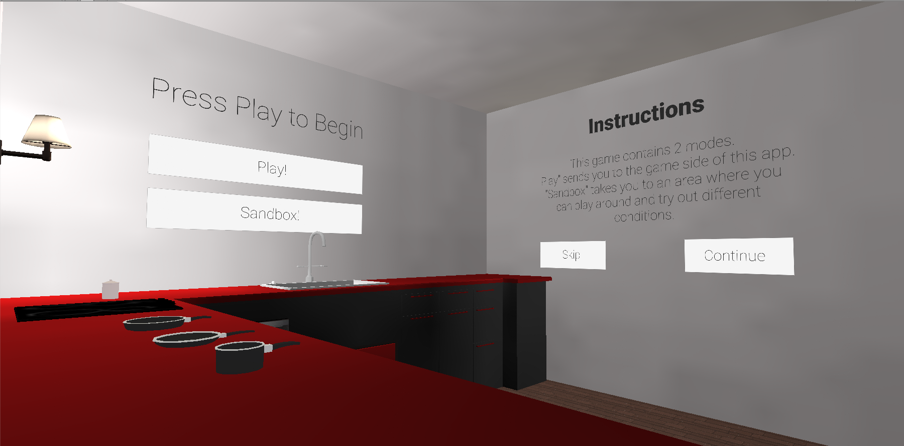

### Reflection:
I finally have a more polished looking game. The baked lighting looks very clean when in VR which is what I was worried about. These scene looks more realistic (as realistic as I could make it with free assests anyway). I am happy with there the project stands, as it is starting to wrap up now.

## Week 15:
### Monday Class:
Today I met with Mary for the first time in quite a while. She had been too busy to come along for meetings. This was the last time I will see her for this project, as she is leaving Dunedin for a while. She sat down with me for an hour and tried out the game and gave some feedback. She seemed to really like it!

### Thursday Class:
I didn't do anything to the game today. I am pretty much finished development at this point, and spent the whole day just cleaning up my project files and my documentation. Not a lot to say other than that.

### Reflection:
This week was essentially my final feedback before I finish this project, and it was all positive! Mary loved the app, and is happy with where it is finishing, which was the goal of this. I am happy with where the app is, and now all thats left is to finish up my documentation for it.

## Week 16:
### Monday Class:
Spent the whole class working through the Openmind Workshop. At this point, I have pretty much finiahed development of the app. I recieved the login details for the Polytech Playstore account, and they want me to upload my app onto their account. Mary also wants this to happen, as it will then be accessible overseas with people who wanted to use the app.  

### Thursday Class:
Today we had our last class of the Semester. This means that this is the last class for work on this project. I have spent the whole day cleaning up my documentation by adding some images I had stored away, as well as cleaning up my project and taking some 'cinematic' shots.

## Overall Reflection:
With the end of the Project upon me, I now have some time to reflect on how it all went. Overall I enjoyed working on this project. This was my first time using Unity, so it was a big learning curve from the beginning, and I have learned a lot about development. I enjoyed working with Mary to bring to life her idea of a visual simulation app, and I have enjoyed learning what I am able to do. I have progressed a lot from the basic VR game I originally created, and I am definitely ready to pursue harder challenges.
